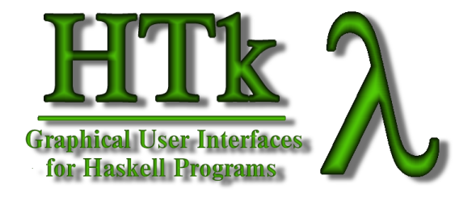

# HTk

Graphical User Interfaces for Haskell Programs.

This was originally developed at the [University Bremen](https://www.uni-bremen.de/),
but abandoned in 2022.

Here is the last version of the official website on the internet archive:
[informatik.uni-bremen.de/htk](https://web.archive.org/web/20220920170419/http://www.informatik.uni-bremen.de/htk/)


## What's HTk?

**HTk** is an encapsulation of the graphical user interface toolkit and library
[Tcl/Tk](https://web.archive.org/web/20220920170419/http://www.scriptics.com/software/tcltk)
for the functional programming language [Haskell](https://web.archive.org/web/20220920170419/http://www.haskell.org/).
It allows the creation of high-quality graphical user interfaces within Haskell
in a typed, abstract, and portable manner,
as **HTk** is known to run under most POSIX systems,
like Linux, Solaris and Mac OS X.

**Features include:**

- Abstract event handling,
- Support of nearly all of Tk's features:
    - The usual GUI elements such as buttons, menus, list boxes, &c;
    - Canvasses to draw on;
    - Text widgets for hypertext and forms;
- A toolkit of useful interface elements and dialog windows,
- No longer tested support for [Tix](https://web.archive.org/web/20220920170419/http://tix.sourceforge.net/),
    the Tk Interace eXtension, with features such as notebooks and paned windows.
- Hierarchical module names and
    [cabal packages](https://web.archive.org/web/20220920170419/http://www.haskell.org/cabal/)
- A program to convert the imports of old sources to hierarchical module names.

**HTk** is easy to use; for example, here is the infamous incrementing button example:

```hs
import HTk.Toplevel.HTk

main :: IO ()
main =
 do main <- initHTk \[\]
    b <- newButton main \[text "\*"\]
    pack b \[\]
    cl <- clicked b
    let count :: Int-> Event ()
        count n =
          do cl >>> (b # text n)
             count (n+1)
    spawnEvent (count 1)
    finishHTk
```


## Documentation

- Read _A Short Introduction to HTk_ ([PDF](./assets/intro.pdf), [PS](./assets/intro.ps.gz),
    [HTML \[ugly\]]([intro/intro/index.html](https://web.archive.org/web/20220921190158/http://www.informatik.uni-bremen.de/htk/intro/intro/index.html)))
    A short, readable introduction for the HTk neophyte.
    Read this first!
- Browse haddock generated documentation of the HTk modules by using cabal to generate the haddock documentation.
- Read "Verkapselung von Tk-Objekten für HTk", a technical manual describing how HTk encapsulates Tk.
    ([PDF](./assets/HOWTO.pdf), [PS](./assets/HOWTO.ps.gz),
    [HTML](https://web.archive.org/web/20220922031350/http://www.informatik.uni-bremen.de/htk/internal/HOWTO/index.html)).
- Check out the original README at [README-OLD.txt](./README-OLD.txt).


## System requirements

You'll need the following software to run **HTk**:

- The [Glasgow Haskell Compiler](https://web.archive.org/web/20220920170419/http://www.haskell.org/ghc),
    Version 6.8.1 or later;
- [Tcl/Tk](https://web.archive.org/web/20220920170419/http://www.scriptics.com/software/tcltk)
    (Version 8.1.1 or later), currently tested with Version 8.4.
- An operating system on which these two run, such as Linux, MacOS or Solaris
    (Windows 89, 2K and FreeBSD used to work, too)


## Installation

1. Clone this repo
    ```sh
    git clone https://github.com/ad-si/htk
    ```
2. Configure and build
    ```sh
    ./configure
    make cabal
    ```
3. Possibly port your old sources by applying `mk/ReplaceModuleNames`


## Problems and Troubleshooting

If you have trouble with **HTk**, please do not hesitate to get in touch with us (see below).
We will try to help, but we can only fix problems that we know about.


## Current Status

Currently, **HTk** is "orphanware" - while still being used and e.g.
ported to later versions of the GHC if it is not too much trouble,
it is not actively developed, and new releases are sparse.
Its future prospects are uncertain.
Use at your own peril.


## Contact and Authors

If you have any questions or request,
please get in touch with us at `uniform@informatik.uni-bremen.de`.


## Credits

The principal designer of HTk was Einar Karlsen, based on GoferTk.
The event handling is due to George Russell.
Further porting was done by Andree Lüdtke, Christian Maeder and
[Christoph Lüth](https://user.informatik.uni-bremen.de/clueth/).
